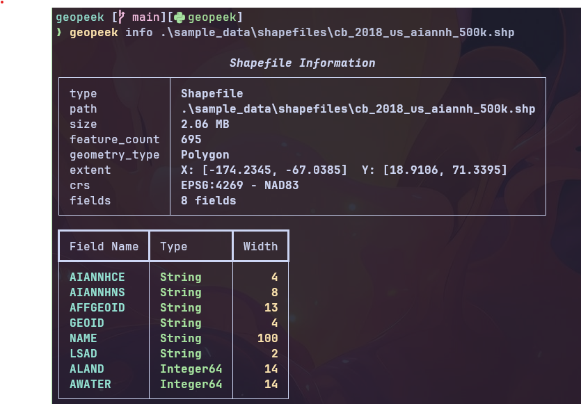
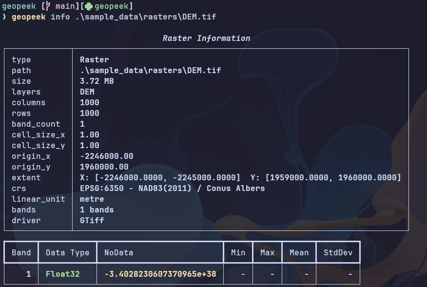

# geopeek

A CLI tool for exploring geospatial data in the terminal. Supports Shapefiles, File Geodatabases, and raster formats via GDAL.

## Installation

```bash
# Using conda (recommended — handles GDAL C libraries automatically)
conda env create -f environment.yml
conda activate geopeek

# Or using pip (requires GDAL to be installed separately)
pip install -e .
```

## Usage

### Dataset info

```bash
# Rich table output (default)
geopeek info path/to/data.shp
geopeek info path/to/data.gdb
geopeek info path/to/raster.tif

# JSON output
geopeek info path/to/data.shp --format json

# List layer names only
geopeek info path/to/data.gdb --layers
geopeek info path/to/data.gdb --layers --format json
```

### Data preview

```bash
# Preview first 10 attribute rows (vector) or band statistics (raster)
geopeek peek path/to/data.shp
geopeek peek path/to/data.gdb

# Show more rows
geopeek peek path/to/data.shp --limit 50

# Preview a specific layer in a multi-layer dataset
geopeek peek path/to/data.gdb --layer buildings

# JSON output
geopeek peek path/to/data.shp --format json
```

### Field/band schema

```bash
# Show field schema (vector) or band schema (raster)
geopeek schema path/to/data.shp
geopeek schema path/to/raster.tif

# Schema for a specific layer
geopeek schema path/to/data.gdb --layer parcels

# JSON output
geopeek schema path/to/data.gdb --format json
```

### Bounding box extent

```bash
# Show extent
geopeek extent path/to/data.shp
geopeek extent path/to/raster.tif

# Extent for a specific layer
geopeek extent path/to/data.gdb --layer roads

# JSON output
geopeek extent path/to/data.shp --format json
```

### Supported formats

| Format           | Extensions                                                      |
| ---------------- | --------------------------------------------------------------- |
| Shapefile        | `.shp`                                                          |
| File Geodatabase | `.gdb`                                                          |
| Raster           | `.tif`, `.tiff`, `.jp2`, `.png`, `.jpg`, `.img`, `.vrt`, `.dem` |

### What you get

**`info`** — Full metadata: CRS, extent, feature count, geometry type, field schema, band info, driver

**`peek`** — Data preview: first N attribute rows for vector datasets, band statistics for rasters

**`schema`** — Field schema: field name, type, width, precision (vector) or band number, data type, nodata, color interpretation, block size (raster)

**`extent`** — Bounding box: xmin, xmax, ymin, ymax with CRS info

## Screenshots

### Shapefile info



### File Geodatabase info

*Coming soon*

### Raster info



## Development

```bash
# Run tests
python -m pytest tests/ -v

# Run as module
python -m geopeek info path/to/data.shp
```

## License

MIT
