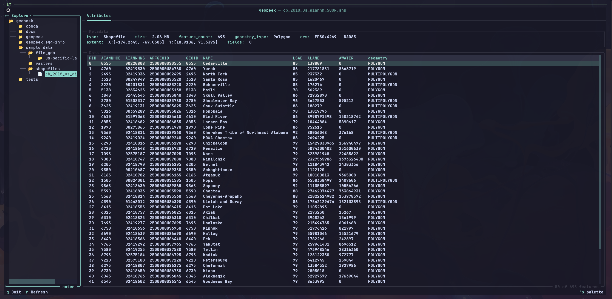

# geopeek

Explore geospatial data without leaving the terminal.

geopeek is a terminal-based tool for inspecting Shapefiles, File Geodatabases, and raster datasets. It provides both an interactive TUI for visual browsing and a CLI for scripting and quick lookups -- all powered by GDAL.

## Installation

```bash
# Using conda (recommended -- handles GDAL C libraries automatically)
conda env create -f environment.yml
conda activate geopeek

# Or using pip (requires GDAL to be installed separately)
pip install -e .
```

## Interactive TUI

The main way to use geopeek. Launch it and browse your datasets visually.

```bash
# Open the explorer to navigate your filesystem
geopeek

# Jump straight to a dataset
geopeek browse path/to/data.shp
geopeek browse path/to/data.gdb
geopeek browse path/to/raster.tif
```



### What the TUI gives you

- **File explorer** -- persistent sidebar filtered to geospatial files only. Navigate your filesystem without the noise.
- **Expandable geodatabases** -- click a `.gdb` to expand it and see all layers inside. Select any layer to inspect it.
- **Metadata panel** -- CRS, extent, geometry type, feature count, and field summary at a glance. Displayed in a compact two-line card.
- **Attribute grid** -- preview the first 50 attribute rows for vector datasets, or band info for rasters.
- **Tabbed interface** -- Attributes tab is the start. More tabs (Fields, Preview) coming soon.
- **Catppuccin Mocha theme** -- a dark color scheme that's easy on the eyes during long sessions.

### Keybindings

| Key | Action |
| --- | --- |
| `q` | Quit |
| `r` | Refresh current dataset |
| `Tab` / `Shift+Tab` | Cycle focus between panels |
| `Enter` | Select file or layer |
| Arrow keys | Navigate explorer / data grid |

### Supported formats

| Format | Extensions |
| --- | --- |
| Shapefile | `.shp` |
| File Geodatabase | `.gdb` (expandable -- browse individual layers) |
| Raster | `.tif`, `.tiff`, `.jp2`, `.png`, `.jpg`, `.img`, `.vrt`, `.dem` |

---

## CLI

For quick lookups, scripting, and piping into other tools.

### `geopeek info` -- dataset metadata

```bash
geopeek info path/to/data.shp
geopeek info path/to/data.gdb
geopeek info path/to/raster.tif

# JSON output
geopeek info path/to/data.shp --format json

# List layer names only
geopeek info path/to/data.gdb --layers
geopeek info path/to/data.gdb --layers --format json
```

### `geopeek peek` -- preview attribute rows

```bash
geopeek peek path/to/data.shp
geopeek peek path/to/data.gdb

# More rows
geopeek peek path/to/data.shp --limit 50

# Specific layer
geopeek peek path/to/data.gdb --layer buildings

# JSON output
geopeek peek path/to/data.shp --format json
```

### `geopeek schema` -- field/band schema

```bash
geopeek schema path/to/data.shp
geopeek schema path/to/raster.tif

# Specific layer
geopeek schema path/to/data.gdb --layer parcels

# JSON output
geopeek schema path/to/data.gdb --format json
```

### `geopeek extent` -- bounding box

```bash
geopeek extent path/to/data.shp
geopeek extent path/to/raster.tif

# Specific layer
geopeek extent path/to/data.gdb --layer roads

# JSON output
geopeek extent path/to/data.shp --format json
```

### CLI summary

| Command | What it shows |
| --- | --- |
| `info` | CRS, extent, feature count, geometry type, field schema, band info |
| `peek` | First N attribute rows for vector datasets |
| `schema` | Field name/type/width (vector) or band type/nodata/block size (raster) |
| `extent` | Bounding box (xmin, xmax, ymin, ymax) with CRS |

---

## Screenshots

### Shapefile info (CLI)


### Raster info (CLI)


## Development

```bash
# Run tests
python -m pytest tests/ -v

# Run as module
python -m geopeek info path/to/data.shp
```

## License

MIT
